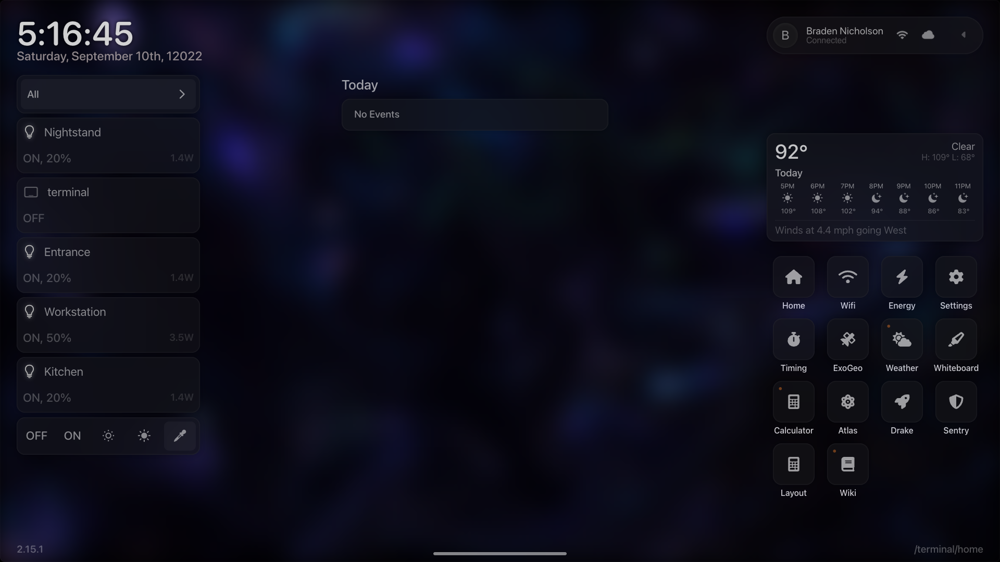
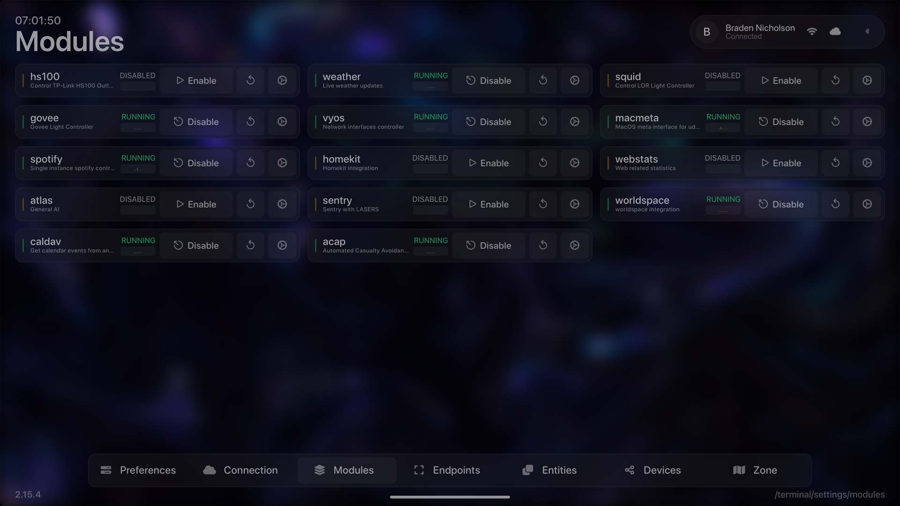
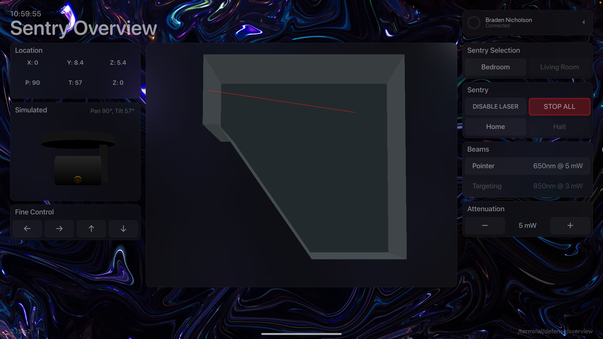
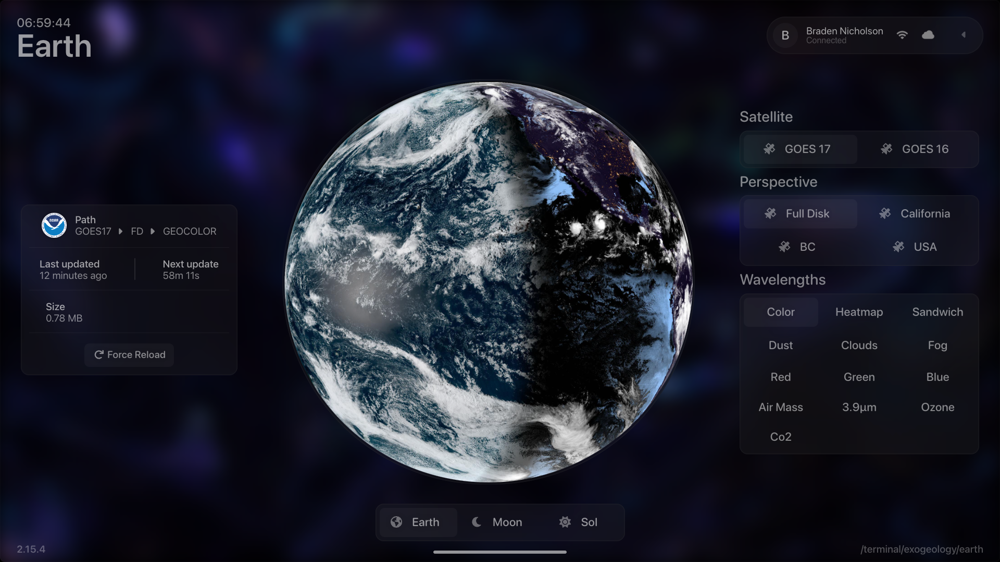
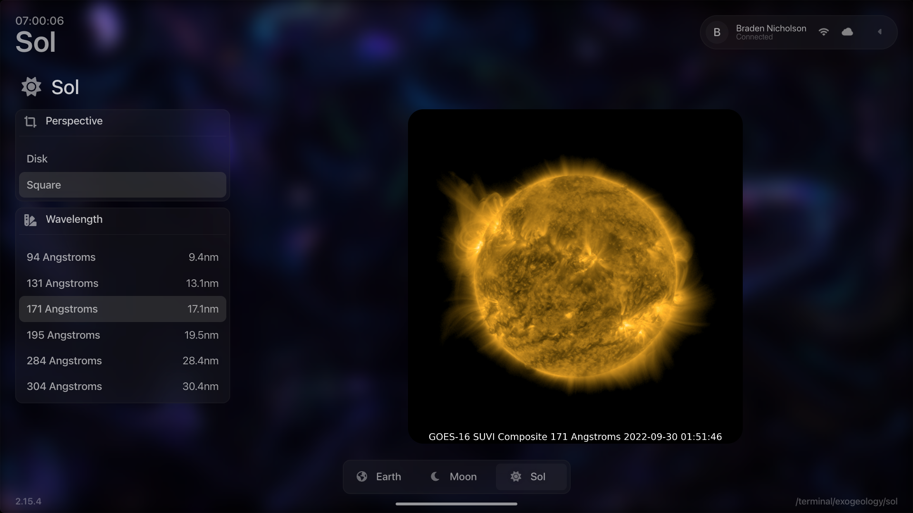
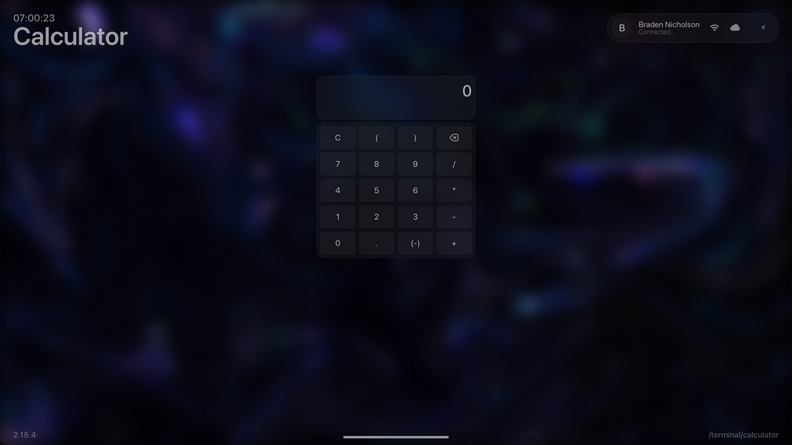
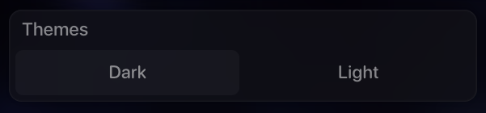
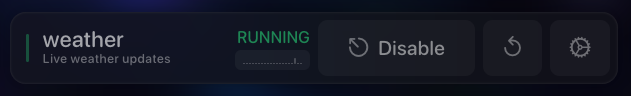
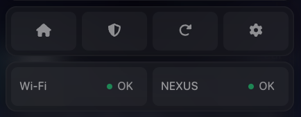

# UDAP v2.16.1

## Universal Device Aggregation Platform

Udap aims to efficiently link and aggregate many unlike interfaces into a heuristic model that can be manipulated and
supplemented from add-on plugins called modules. These modules are written in go and compile during Udap's runtime.
Modules can be configured to control computer settings, lights, music, air conditioners, phone systems, access points,
media, or even spaceships.

## Entities & Attributes

Any state within udap is stored within an attribute. These attributes belong to a parent entity.

An example:

You have a smart light bulb. It has two settings through it's api (which you've linked via a module), brightness and
color hue. Each of these settings becomes its own attribute. The smart bulb is represented as an entity who's 'id' is
linked to the aforementioned attributes.

Another examples:

You want to connect spotify to udap. Spotify's API has a lot of options, but we can just focus two attributes:
isPlaying and currentSong. First you create an entity to represent the api, then you create and provide channels for
resolving each attribute's status.

## Glossary

| Command  | Description |
|----------| --- |
| U.D.A.P. | Universal Device Aggregation Platform (encompasses all below terms) |
| Core     | The physical running UDAP program instance |
| Nexus    | The front-end interface for all of UDAP |
| Terminal | An authoritative nexus instance (Used for configuration and management) |
| Pad      | A general use nexus instance, can be used by anyone without authentication if configured by terminal. |

### Terminal Screenshots

This is not an exhaustive list of UDAP's applications and configurations. There are more than sixty views in total.

A screenshot of the terminal unlocked screen as of v2.15.1. (With the background blur setting enabled)

### Terminal Settings

#### Module page

This page allows an authenticated user to manage and monitor the runtime of UDAP's modules.

#### Terminal App Examples

The sentry app controls a ceiling-mounted laser used for entertaining cats. The interface provides realtime positioning
on of the beam, and allows for manual targeting and attenuation.   (With BG blur setting disabled)

#### Exogeology App

The exogeology app uses data from NOAA to display near-live images of the Earth and the Sol (the sun).

##### Earth Page

##### Sol Page

#### Basic Utility Apps

##### Calculator App

## Front-end elements

#### Element

An element is a super class of a Plot, Pane, or other ui element that has a blurred background.

### Plots

A Plot is a grid-like element that contains a fixed number of cells defined by a number of rows and columns.
Plots can be configured to have a title and alt button. Plots are usually used to hold buttons or other contextual
elements.

##### Plot Selection (from Settings->Preferences page)

##### Plot Module (from Settings->Modules page)

Plots can contain custom dom to serve whatever purpose is needed:

##### Plot Buttons (from Global context Menu)

Plots are best used for providing many buttons for easy selection.

#### Copyright &copy; 2019-2022 Braden Nicholson
