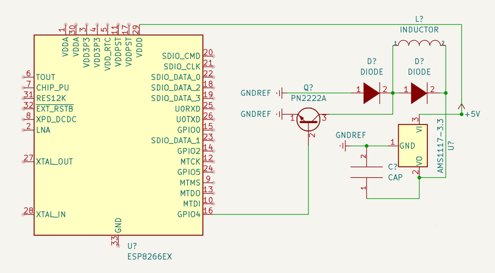

### ESP Haptic Feedback

Use an ALPS AFT14A903A with an ESP32 to introduce haptic feedback to touchscreens.

### Electrical schematic


The AMS1117-3.3 is completely redundant when used with an ESP32, but I managed to smoke the built-in one.

### Endpoints

##### Request

Trigger a basic one-time vibration event

`0`: 160Hz -- 3 x 3.125ms pulses @ `29.4m/s^2 (3G)`

`1`: 320Hz -- 3 x 1.562ms pulses @ `22.3m/s^2(2.28G)`

`2`: 160Hz -- 3 x 1.562ms sin pulses

`POST /pop`

```json
{
  "power": 1
}
```

##### Response

`200: OK`

**Copyright &copy; Braden Nicholson 2019 - 2022**

All Rights Reserved. Do not distribute.
